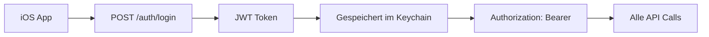

# BC Marl Drinks - iOS App Integration Briefing

**Datum:** 31. August 2025  
**Für:** iOS App Entwicklung mit Cursor/Claude  
**Backend Status:** Vollständig implementiert und getestet  
**Ziel:** Komplette iOS App mit Backend-Integration  

---

## 1. Backend-Übersicht

### 1.1 Aktueller Status
- ✅ **REST API vollständig implementiert** und getestet
- ✅ **JWT Authentication** mit 24h Token-Lebensdauer
- ✅ **Admin-Interface** mit Icon-Upload-System
- ✅ **Datenbank** mit Sample-Daten gefüllt
- ✅ **Docker-Environment** produktionsreif
- ✅ **CORS** für mobile Apps konfiguriert

### 1.2 Backend URLs
```
Development: http://localhost:8080/v1
Production:  https://api.bcmarl-drinks.de/v1  (später)
Admin:       http://localhost:8080/admin
```

### 1.3 Technologie-Stack
- **Backend:** PHP 8.2 + Slim Framework
- **Database:** MySQL 8.0
- **Authentication:** JWT (HS256)
- **File Upload:** Automatische Bildverarbeitung (64x64px)
- **Containerization:** Docker + Docker Compose

---

## 2. API Authentifizierung

### 2.1 Authentifizierungs-Flow


### 2.2 Login-Endpunkte

#### Erstanmeldung (PIN setzen)
```http
POST /v1/auth/first-login
Content-Type: application/json

{
  "email": "string",
  "mobile": "string", 
  "pin": "string (4 digits)"
}
```

**Response:**
```json
{
  "success": true,
  "token": "eyJ0eXAiOiJKV1QiLCJhbGciOiJI...",
  "user": {User Object},
  "message": "PIN erfolgreich gesetzt"
}
```

#### Regulärer Login
```http
POST /v1/auth/login
Content-Type: application/json

{
  "email": "string",
  "mobile": "string",
  "pin": "string (4 digits)"
}
```

#### Token validieren
```http
GET /v1/auth/validate
Authorization: Bearer <token>
```

---

## 3. iOS Datenmodelle

### 3.1 User Model
```swift
struct User: Codable {
    let id: String
    let firstName: String
    let lastName: String
    let email: String
    let mobile: String
    let role: String  // "user" | "admin"
    let balanceCents: Int
    let lowBalanceThresholdCents: Int
    let locked: Bool
    let failedLoginAttempts: Int
    let createdAt: String
    let updatedAt: String
    
    // Computed Properties
    var balanceEuro: Double { Double(balanceCents) / 100.0 }
    var thresholdEuro: Double { Double(lowBalanceThresholdCents) / 100.0 }
    var fullName: String { "\(firstName) \(lastName)" }
    var hasLowBalance: Bool { balanceCents < lowBalanceThresholdCents }
}
```

### 3.2 Product Model
```swift
struct Product: Codable, Identifiable {
    let id: String
    let name: String
    let icon: String  // Path to icon: "/images/icons/beer.svg" or "/images/uploads/..."
    let priceCents: Int
    let category: ProductCategory
    let active: Bool
    let createdAt: String
    let updatedAt: String
    
    // Computed Properties
    var priceEuro: Double { Double(priceCents) / 100.0 }
    var iconURL: URL? { URL(string: "http://localhost:8080\(icon)") }
}

enum ProductCategory: String, Codable, CaseIterable {
    case drinks = "DRINKS"
    case snacks = "SNACKS"
    case accessories = "ACCESSORIES"
    case membership = "MEMBERSHIP"
    
    var localizedName: String {
        switch self {
        case .drinks: return "Getränke"
        case .snacks: return "Snacks"
        case .accessories: return "Zubehör"
        case .membership: return "Mitgliedschaft"
        }
    }
    
    var systemIcon: String {
        switch self {
        case .drinks: return "cup.and.saucer"
        case .snacks: return "takeoutbag.and.cup.and.straw"
        case .accessories: return "tshirt"
        case .membership: return "person.badge.plus"
        }
    }
}
```

### 3.3 Booking Model
```swift
struct Booking: Codable, Identifiable {
    let id: String
    let userId: String
    let productId: String
    let quantity: Int
    let unitPriceCents: Int
    let totalCents: Int
    let timestamp: String
    let status: String  // "booked" | "voided"
    
    // Computed Properties
    var totalEuro: Double { Double(totalCents) / 100.0 }
    var unitPriceEuro: Double { Double(unitPriceCents) / 100.0 }
    var date: Date? {
        ISO8601DateFormatter().date(from: timestamp)
    }
}

struct BookingResult: Codable {
    let success: Bool
    let booking: Booking
    let transaction: Transaction
    let newBalance: Int
    let balanceBelowThreshold: Bool
    
    var newBalanceEuro: Double { Double(newBalance) / 100.0 }
}
```

### 3.4 Transaction Model
```swift
struct Transaction: Codable, Identifiable {
    let id: String
    let userId: String
    let type: TransactionType
    let amountCents: Int
    let reference: String?
    let timestamp: String
    let enteredByAdminId: String?
    
    var amountEuro: Double { Double(amountCents) / 100.0 }
}

enum TransactionType: String, Codable {
    case deposit = "DEPOSIT"
    case debit = "DEBIT"
    case reversal = "REVERSAL"
    
    var localizedName: String {
        switch self {
        case .deposit: return "Einzahlung"
        case .debit: return "Abbuchung"
        case .reversal: return "Stornierung"
        }
    }
    
    var color: Color {
        switch self {
        case .deposit, .reversal: return .green
        case .debit: return .red
        }
    }
}
```

---

## 4. API Endpunkte für iOS

### 4.1 Produktverwaltung
```swift
// Alle Produkte laden
GET /v1/products?category=DRINKS&active=true

// Einzelnes Produkt
GET /v1/products/{productId}

// Response Format:
{
  "success": true,
  "products": [Product],
  "total": integer
}
```

### 4.2 Benutzer-Endpunkte
```swift
// Eigenes Profil
GET /v1/me

// Schwellenwert ändern
PATCH /v1/me/threshold
{
  "lowBalanceThresholdCents": integer
}

// PIN ändern
PATCH /v1/me/pin
{
  "currentPin": "string",
  "newPin": "string"
}
```

### 4.3 Favoriten
```swift
// Favoriten laden
GET /v1/me/favorites

// Favorit hinzufügen
POST /v1/me/favorites
{
  "productId": "string"
}

// Favorit entfernen
DELETE /v1/me/favorites/{productId}
```

### 4.4 Buchungen
```swift
// Buchung erstellen
POST /v1/bookings
{
  "productId": "string",
  "quantity": integer
}

// Eigene Buchungen
GET /v1/me/bookings?from=2025-08-01&includeVoided=false

// Transaktionen
GET /v1/me/transactions?from=2025-08-01&type=DEBIT
```

---

## 5. Test-Daten

### 5.1 Verfügbare Benutzer
```json
{
  "admin": {
    "email": "admin@bcmarl.de",
    "mobile": "01234567890",
    "pin": "1234",
    "balance": "100.00 EUR",
    "role": "admin"
  },
  "users": [
    {
      "email": "anna@example.com", 
      "mobile": "01111111111",
      "balance": "25.00 EUR",
      "role": "user"
    },
    {
      "email": "tom@example.com",
      "mobile": "02222222222", 
      "balance": "18.00 EUR",
      "role": "user"
    }
  ]
}
```

### 5.2 Verfügbare Produkte (35+ Produkte)
```json
[
  {
    "name": "Pils 0,5l",
    "category": "DRINKS",
    "priceCents": 250,
    "icon": "/images/icons/beer.svg"
  },
  {
    "name": "Cola 0,33l", 
    "category": "DRINKS",
    "priceCents": 180,
    "icon": "/images/icons/cola.svg"
  },
  {
    "name": "Chips Paprika",
    "category": "SNACKS", 
    "priceCents": 150,
    "icon": "/images/icons/chips.svg"
  }
]
```

---

## 6. iOS Implementation Guide

### 6.1 Erforderliche Dependencies
```swift
// Package.swift oder Xcode Package Manager
dependencies: [
    .package(url: "https://github.com/kishikawakatsumi/KeychainAccess", from: "4.2.2"),
    .package(url: "https://github.com/Alamofire/Alamofire", from: "5.7.1")  // Optional
]
```

### 6.2 Recommended App Architecture
```
iOS App Structure:
├── Models/
│   ├── User.swift
│   ├── Product.swift
│   ├── Booking.swift
│   └── Transaction.swift
├── Services/
│   ├── APIClient.swift
│   ├── AuthService.swift
│   ├── ProductService.swift
│   └── BookingService.swift
├── Views/
│   ├── LoginView.swift
│   ├── ProductListView.swift
│   ├── BookingView.swift
│   └── ProfileView.swift
└── ViewModels/
    ├── AuthViewModel.swift
    ├── ProductViewModel.swift
    └── BookingViewModel.swift
```

### 6.3 Core Features zu implementieren

#### Phase 1: Authentication
- [x] Login Screen mit E-Mail, Mobile, PIN
- [x] First Login (PIN setzen) 
- [x] Token Management im Keychain
- [x] Auto-Logout bei 401 Responses

#### Phase 2: Product Management  
- [x] Produktliste mit Kategorien
- [x] Favoriten verwalten
- [x] Icon-Darstellung (AsyncImage)
- [x] Such- und Filter-Funktionen

#### Phase 3: Booking System
- [x] Warenkorb-Funktionalität 
- [x] Buchung erstellen
- [x] Guthaben-Anzeige
- [x] Low-Balance-Warnung

#### Phase 4: User Profile
- [x] Profil-Anzeige
- [x] Guthaben-Management
- [x] Transaktionshistorie
- [x] Schwellenwert-Einstellungen

---

## 7. API Client Template

### 7.1 Base API Client
```swift
import Foundation
import KeychainAccess

class APIClient {
    static let shared = APIClient()
    
    private let baseURL = "http://localhost:8080/v1"
    private let session = URLSession.shared
    private let keychain = Keychain(service: "de.bcmarl.drinks")
    
    // Generic Request Method
    func request<T: Codable>(
        endpoint: String,
        method: HTTPMethod = .GET,
        body: [String: Any]? = nil,
        responseType: T.Type
    ) async throws -> T {
        
        guard let url = URL(string: "\(baseURL)\(endpoint)") else {
            throw APIError.invalidURL
        }
        
        var request = URLRequest(url: url)
        request.httpMethod = method.rawValue
        request.setValue("application/json", forHTTPHeaderField: "Content-Type")
        
        // Authentication Header
        if let token = keychain["authToken"] {
            request.setValue("Bearer \(token)", forHTTPHeaderField: "Authorization")
        }
        
        // Request Body
        if let body = body {
            request.httpBody = try JSONSerialization.data(withJSONObject: body)
        }
        
        // Execute Request
        let (data, response) = try await session.data(for: request)
        
        guard let httpResponse = response as? HTTPURLResponse else {
            throw APIError.invalidResponse
        }
        
        // Handle HTTP Status Codes
        switch httpResponse.statusCode {
        case 200...299:
            return try JSONDecoder().decode(T.self, from: data)
        case 401:
            // Token expired - logout user
            keychain["authToken"] = nil
            throw APIError.unauthorized
        case 400...499:
            throw APIError.clientError(httpResponse.statusCode)
        case 500...599:
            throw APIError.serverError(httpResponse.statusCode)
        default:
            throw APIError.unknownError
        }
    }
}

enum HTTPMethod: String {
    case GET = "GET"
    case POST = "POST" 
    case PATCH = "PATCH"
    case DELETE = "DELETE"
}

enum APIError: LocalizedError {
    case invalidURL
    case invalidResponse
    case unauthorized
    case clientError(Int)
    case serverError(Int)
    case unknownError
    
    var errorDescription: String? {
        switch self {
        case .unauthorized:
            return "Anmeldung erforderlich"
        case .clientError(let code):
            return "Client-Fehler (\(code))"
        case .serverError(let code):
            return "Server-Fehler (\(code))"
        default:
            return "Unbekannter Fehler"
        }
    }
}
```

---

## 8. Wichtige API Response Strukturen

### 8.1 Standard Response Wrapper
```swift
struct APIResponse<T: Codable>: Codable {
    let success: Bool
    let data: T?
    let error: String?
    let message: String?
}

struct ProductsResponse: Codable {
    let success: Bool
    let products: [Product]
    let total: Int
}

struct UserResponse: Codable {
    let success: Bool
    let user: User
}

struct LoginResponse: Codable {
    let success: Bool
    let token: String
    let user: User
    let message: String?
}
```

---

## 9. Test-Szenarien

### 9.1 Login-Tests
```swift
// Test User Credentials
let testUsers = [
    ("admin@bcmarl.de", "01234567890", "1234"),      // Admin
    ("anna@example.com", "01111111111", "new"),      // First login
    ("tom@example.com", "02222222222", "existing")   // Regular user
]
```

### 9.2 API Test Calls
```bash
# Health Check
curl http://localhost:8080/v1/health

# Login Test
curl -X POST http://localhost:8080/v1/auth/login \
  -H "Content-Type: application/json" \
  -d '{"email":"admin@bcmarl.de","mobile":"01234567890","pin":"1234"}'

# Products Test
curl http://localhost:8080/v1/products
```

---

## 10. iOS App Requirements

### 10.1 Minimum Requirements
- **iOS Version:** 15.0+
- **Xcode Version:** 14.0+
- **Swift Version:** 5.7+

### 10.2 Suggested UI Framework
- **SwiftUI** mit Navigation Stack
- **Combine** für Reactive Programming
- **AsyncImage** für Icon-Loading

### 10.3 Required Capabilities
- **Network Access** für API Calls
- **Keychain Access** für Token Storage
- **Photo Library** (optional - für Profil-Features)

---

## 11. App Features zu implementieren

### 11.1 Core Features (MVP)

#### 🔐 Authentication
- [ ] **Login Screen** (E-Mail, Mobile, PIN)
- [ ] **First Login** (PIN setzen)
- [ ] **Token Management** im Keychain
- [ ] **Auto-Logout** bei Token-Expire

#### 🛍️ Product Catalog
- [ ] **Produktliste** mit Kategorien
- [ ] **Icon-Darstellung** (AsyncImage)
- [ ] **Such-Funktion** nach Produktnamen
- [ ] **Kategorie-Filter**
- [ ] **Favoriten** hinzufügen/entfernen

#### 🛒 Booking System
- [ ] **Warenkorb** für mehrere Artikel
- [ ] **Buchung erstellen** 
- [ ] **Guthaben-Anzeige** prominent
- [ ] **Low-Balance-Warnung**
- [ ] **Buchungsbestätigung**

#### 👤 User Profile
- [ ] **Profil-Anzeige** (Name, Guthaben)
- [ ] **Transaktionshistorie**
- [ ] **Schwellenwert** einstellen
- [ ] **PIN ändern**

### 11.2 Advanced Features

#### 📊 Statistics & History
- [ ] **Buchungshistorie** mit Filter
- [ ] **Ausgaben-Übersicht** (Monat/Jahr)
- [ ] **Favoriten-Management**
- [ ] **Export-Funktion** (CSV)

#### 🔔 Notifications
- [ ] **Push Notifications** für Low-Balance
- [ ] **Background Fetch** für Guthaben-Updates
- [ ] **Local Notifications** für Erinnerungen

#### 🎨 UI/UX Enhancements
- [ ] **Dark Mode** Support
- [ ] **Accessibility** Features
- [ ] **Haptic Feedback**
- [ ] **Custom App Icon**

---

## 12. Integration Steps

### 12.1 Setup Phase
1. **Xcode Projekt** erstellen
2. **Dependencies** hinzufügen (KeychainAccess)
3. **API Models** implementieren
4. **Base API Client** erstellen
5. **Authentication Service** implementieren

### 12.2 Development Phase  
1. **Login Flow** implementieren und testen
2. **Product Service** und Views erstellen
3. **Booking System** implementieren
4. **User Profile** Features
5. **Error Handling** und Edge Cases

### 12.3 Testing Phase
1. **Unit Tests** für Services
2. **Integration Tests** mit Backend
3. **UI Tests** für kritische Flows
4. **Performance Testing**

---

## 13. Backend API Endpoints (Complete List)

### 13.1 Authentication
```
POST /v1/auth/first-login     - PIN setzen
POST /v1/auth/login           - Anmeldung
POST /v1/auth/reset-pin-request - PIN Reset anfragen
POST /v1/auth/reset-pin-confirm - PIN Reset bestätigen
GET  /v1/auth/validate        - Token validieren
```

### 13.2 User Management
```
GET    /v1/me                 - Eigenes Profil
PATCH  /v1/me/threshold       - Schwellenwert ändern
PATCH  /v1/me/pin            - PIN ändern
GET    /v1/me/favorites       - Favoriten laden
POST   /v1/me/favorites       - Favorit hinzufügen
DELETE /v1/me/favorites/{id}  - Favorit entfernen
GET    /v1/me/bookings        - Eigene Buchungen
GET    /v1/me/transactions    - Eigene Transaktionen
```

### 13.3 Products
```
GET /v1/products              - Alle Produkte
GET /v1/products/{id}         - Einzelnes Produkt
```

### 13.4 Bookings
```
POST /v1/bookings             - Buchung erstellen
```

---

## 14. Error Handling

### 14.1 HTTP Status Codes
```swift
200 - Success
201 - Created  
400 - Bad Request (Validierungsfehler)
401 - Unauthorized (Token ungültig/abgelaufen)
403 - Forbidden (Keine Berechtigung)
404 - Not Found (Ressource nicht gefunden)
409 - Conflict (z.B. Favorit bereits vorhanden)
422 - Unprocessable Entity
500 - Internal Server Error
```

### 14.2 API Error Format
```json
{
  "success": false,
  "error": "ERROR_CODE",
  "message": "Benutzerfreundliche Fehlermeldung"
}
```

---

## 15. Security Considerations

### 15.1 Token Storage
- **Verwende Keychain** für JWT Token
- **Niemals UserDefaults** für sensitive Daten
- **Auto-Clear** bei App-Uninstall

### 15.2 Network Security
- **Certificate Pinning** für Production
- **Request Timeouts** implementieren
- **Retry Logic** für failed requests

---

## 16. Development Workflow

### 16.1 Backend starten
```bash
cd bc_marl_drinks_backend
docker-compose up -d
# API verfügbar auf: http://localhost:8080
```

### 16.2 API Testen
```bash
# Health Check
curl http://localhost:8080/v1/health

# Admin Login
curl -X POST http://localhost:8080/v1/auth/login \
  -H "Content-Type: application/json" \
  -d '{"email":"admin@bcmarl.de","mobile":"01234567890","pin":"1234"}'
```

### 16.3 Admin Interface
```
http://localhost:8080/admin/login   - Admin Login
http://localhost:8080/admin         - Dashboard  
http://localhost:8080/admin/products - Produktverwaltung
```

---

## 17. Next Steps für iOS Development

### 17.1 Sofortige Todos
1. **Xcode Projekt** setup
2. **API Client** implementieren
3. **Login Flow** erstellen
4. **Product List** mit Backend-Integration
5. **Basic Booking** implementieren

### 17.2 Backend ist bereit
- ✅ Alle Endpunkte getestet
- ✅ Sample-Daten verfügbar
- ✅ Authentication funktional
- ✅ CORS für iOS konfiguriert
- ✅ Icon-System funktional

---

## 18. Support & Debugging

### 18.1 Backend Logs
```bash
# API Container Logs
docker-compose logs -f api

# Database Access
docker-compose exec mysql mysql -u bcmarl_user -p bcmarl_drinks
```

### 18.2 Test Endpoints
- **Health:** http://localhost:8080/v1/health
- **Products:** http://localhost:8080/v1/products  
- **API Root:** http://localhost:8080/

### 18.3 Admin Interface für Testing
- **URL:** http://localhost:8080/admin
- **Login:** admin@bcmarl.de / 01234567890 / 1234
- **Features:** Benutzer-/Produktverwaltung, Statistiken

---

**Das Backend ist vollständig einsatzbereit für die iOS App-Entwicklung!** 🍺

Alle API-Endpunkte sind implementiert, getestet und dokumentiert. Die iOS App kann sofort mit der Integration beginnen.
